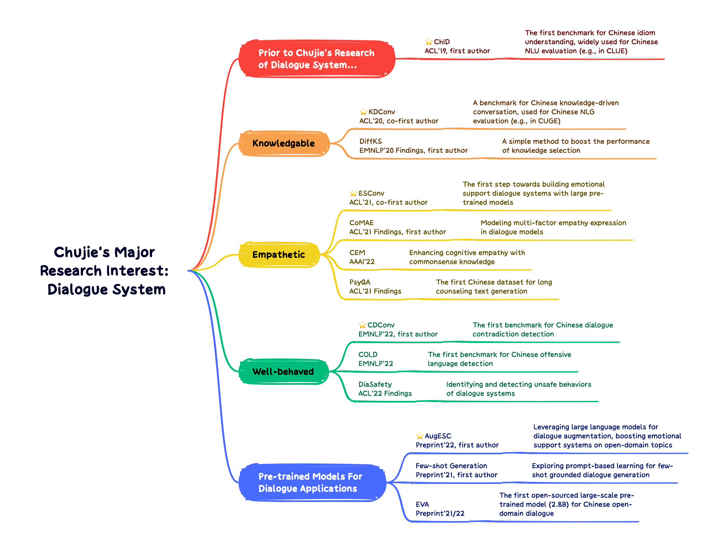

Welcome! I am a third-year Ph.D candidate of [THU CoAI group](http://coai.cs.tsinghua.edu.cn/), advised by [Prof. Minlie Huang](http://coai.cs.tsinghua.edu.cn/hml/). Prior to my Ph.D career, I received my B.Sc degree from Dept. of Physics, Tsinghua University.

I have a broad research interest in **natural language generation and dialogue system**. I am especially interested in building **trustworthy NLG systems**. In the past years, I have built a series of **popular Chinese NLP / dialogue benchmarks**, including [**ChID**](https://github.com/chujiezheng/ChID-Dataset), [**KDConv**](https://github.com/thu-coai/KdConv), [**ESConv**](https://github.com/thu-coai/Emotional-Support-Conversation) and [**CDConv**](https://github.com/thu-coai/CDConv). I also co-built many fundamental resources, including the pre-trained model [EVA](https://github.com/thu-coai/EVA) and the datasets [PsyQA](https://github.com/thu-coai/PsyQA), [DiaSafety](https://github.com/thu-coai/DiaSafety), and [COLD](https://github.com/thu-coai/COLDataset). Proud to see these work promoting the advances of Chinese NLP / Dialogue research!

The figure below gives an overview of my major research projects. You can find my CV [**here** (English)](./cv_chujie_en.pdf).

## Education

- Aug 2020 - Jul 2025 (Expected). Ph.D student in [CoAI group](http://coai.cs.tsinghua.edu.cn/), Dept. of Computer Science and Technology, [Tsinghua University](https://www.tsinghua.edu.cn/). Advisor: [Prof. Minlie Huang](http://coai.cs.tsinghua.edu.cn/hml/)
- Aug 2016 - Jul 2020. B.Sc. in Dept. of Physics, [Tsinghua University](https://www.tsinghua.edu.cn/). Major GPA: 3.98/4.00 (ranking 2/59)

## Main Publications

*\* indicates equal contribution.*

1. **Chujie Zheng\***, Jinfeng Zhou\*, Yinhe Zheng, Libiao Peng, Zhen Guo, Wenquan Wu, Zhengyu Niu, Hua Wu and Minlie Huang. *CDConv: A Benchmark for Contradiction Detection in Chinese Conversations*. <u>EMNLP 2022</u>. [[paper]](https://arxiv.org/abs/2210.08511) [[repo]](https://github.com/thu-coai/CDConv)
2. Siyang Liu\*, **Chujie Zheng\***, Orianna Demasi, Sahand Sabour, Yu Li, Zhou Yu, Yong Jiang and Minlie Huang. *Towards Emotional Support Dialog Systems*. <u>ACL 2021</u>. [[paper]](https://arxiv.org/abs/2106.01144) [[repo]](https://github.com/thu-coai/Emotional-Support-Conversation)
3. **Chujie Zheng**, Yong Liu, Wei Chen, Yongcai Leng and Minlie Huang. *CoMAE: A Multi-factor Hierarchical Framework for Empathetic Response Generation*. <u>Findings of ACL 2021</u>. [[paper]](https://arxiv.org/abs/2105.08316) [[repo]](https://github.com/chujiezheng/CoMAE)
4. **Chujie Zheng**, Yunbo Cao, Daxin Jiang and Minlie Huang. *Difference-aware Knowledge Selection for Knowledge-grounded Conversation Generation*. <u>Findings of EMNLP 2020</u>. [[paper]](https://arxiv.org/abs/2009.09378) [[repo]](https://github.com/chujiezheng/DiffKS)
5. Hao Zhou\*, **Chujie Zheng\***, Kaili Huang, Minlie Huang and Xiaoyan Zhu. *KdConv: A Chinese Multi-domain Dialogue Dataset Towards Multi-turn Knowledge-driven Conversation*. <u>ACL 2020</u>. [[paper]](https://arxiv.org/abs/2004.04100) [[repo]](https://github.com/thu-coai/KdConv)
6. **Chujie Zheng**, Minlie Huang and Aixin Sun. *ChID: A Large-scale Chinese IDiom Dataset for Cloze Test*. <u>ACL 2019</u>. [[paper]](https://arxiv.org/abs/1906.01265) [[repo]](https://github.com/chujiezheng/ChID-Dataset)
7. Jiawen Deng\*, Jingyan Zhou\*, Hao Sun, **Chujie Zheng**, Fei Mi, Helen Meng and Minlie Huang. *COLD: A Benchmark for Chinese Offensive Language Detection*. <u>EMNLP 2022</u>. [[paper]](https://arxiv.org/abs/2201.06025) [[repo]](https://github.com/thu-coai/COLDataset)
8. Hao Sun\*, Guangxuan Xu\*, Jiawen Deng, Jiale Cheng, **Chujie Zheng**, Hao Zhou, Nanyun Peng, Xiaoyan Zhu and Minlie Huang. *On the Safety of Conversational Models: Taxonomy, Dataset, and Benchmark*. <u>Findings of ACL 2022</u>. [[paper]](https://arxiv.org/abs/2110.08466) [[repo]](https://github.com/thu-coai/DiaSafety)
9. Sahand Sabour, **Chujie Zheng** and Minlie Huang. *CEM: Commonsense-aware Empathetic Response Generation*. <u>AAAI 2022</u>. [[paper]](https://arxiv.org/abs/2109.05739) [[repo]](https://github.com/Sahandfer/CEM)
10. Hao Sun\*, Zhenru Lin\*, **Chujie Zheng**, Siyang Liu and Minlie Huang. *PsyQA: A Chinese Dataset for Generating Long Counseling Text for Mental Health Support*. <u>Findings of ACL 2021</u>. [[paper]](https://arxiv.org/abs/2106.01702) [[repo]](https://github.com/thu-coai/PsyQA)

## Preprints

1. **Chujie Zheng**, Sahand Sabour, Jiaxin Wen and Minlie Huang. *AugESC: Large-scale Data Augmentation for Emotional Support Conversation with Pre-trained Language Models*. <u>arXiv:2202.13047</u>. [[paper]](https://arxiv.org/abs/2202.13047)
2. **Chujie Zheng** and Minlie Huang. *Exploring Prompt-based Few-shot Learning for Grounded Dialog Generation*. <u>arXiv:2109.06513</u>. [[paper]](https://arxiv.org/abs/2109.06513)
3. Jinfeng Zhou, **Chujie Zheng**, Bo Wang, Zheng Zhang and Minlie Huang. *CASE: Aligning Coarse-to-Fine Cognition and Affection for Empathetic Response Generation*. <u>arXiv:2208.08845</u>. [[paper]](https://arxiv.org/abs/2208.08845)
4. Yuxian Gu\*, Jiaxin Wen\*, Hao Sun\*, Yi Song, Pei Ke, **Chujie Zheng**, Zheng Zhang, Jianzhu Yao, Lei Liu, Xiaoyan Zhu and Minlie Huang. *EVA2.0: Investigating Open-Domain Chinese Dialogue Systems with Large-Scale Pre-Training*. <u>arXiv:2203.09313</u>. [[paper]](https://arxiv.org/abs/2203.09313) [[repo]](https://github.com/thu-coai/EVA)
5. Hao Zhou\*, Pei Ke\*, Zheng Zhang\*, Yuxian Gu, Yinhe Zheng, **Chujie Zheng**, Yida Wang, Chen Henry Wu, Hao Sun, Xiaocong Yang, Bosi Wen, Xiaoyan Zhu, Minlie Huang and Jie Tang. *EVA: An Open-Domain Chinese Dialogue System with Large-Scale Generative Pre-Training*. <u>arXiv:2108.01547</u>. [[paper]](https://arxiv.org/abs/2108.01547) [[repo]](https://github.com/thu-coai/EVA)

## Talks

- Nov 2022, Shanghai AI Lab. *Towards Well-behaved Dialogue Systems*.
- Jul 2021, AI Time. *Approaches of Empathy Expression and Emotional Support in Dialogue Systems*. [[video]](https://www.bilibili.com/video/BV1YB4y1N7L7/)
- Nov 2020, Biendata & PaperWeekly. *Difference-aware Knowledge Selection for Knowledge-grounded Conversation Generation*. [[video]](https://www.bilibili.com/video/BV1fZ4y137UJ/)
- Jul 2020, AI Time. *KdConv: A Chinese Multi-domain Dialogue Dataset Towards Multi-turn Knowledge-driven Conversation*. [[video]](https://www.bilibili.com/video/BV1g54y1D7TG/)

## Services

- Reviewer: ACL'22, EMNLP'21/22, AAAI'22/23, EACL'23, KNOSYS, TIST
- Review Assistant: EMNLP'20, AAAI'21, COLING'20
- Organizer:
  - May 2020 - Aug 2020. [SMP2020-ECDT](https://smp2020.aconf.cn/smp.html#3) Task 2
  - Jun 2019 - Nov 2019. [Chinese Idiom MRC Competition](https://biendata.com/competition/idiom/) [[data & codes]](https://github.com/chujiezheng/ChID-Dataset/tree/master/Competition)

## Experiences

- Feb 2022 - Jun 2022. Research Intern. General Dialogue Group, Baidu, Beijing, China.
- Jun 2020 - Sep 2020. Research Intern. AI Interactive Technology Team, Sogou, Hangzhou, China.

## Selected Awards and Honors

- **Comprehensive Scholarship (2nd Prize)**, Tsinghua University, 2022
- **Comprehensive Scholarship (2nd Prize)**, Tsinghua University, 2021
- **Excellent Thesis (Top 5/100)**, Tsinghua University, 2020
- **Outstanding Graduate**, Tsinghua University, 2020
- **Chi-Sun YEH (叶企孙) Scholarship (Top 5/100)**, Dept. of Physics, Tsinghua University, 2020
- **National Scholarship (Top 2/100)**, 2019
- **Overall Excellence Scholarship**, Tsinghua University, 2018
